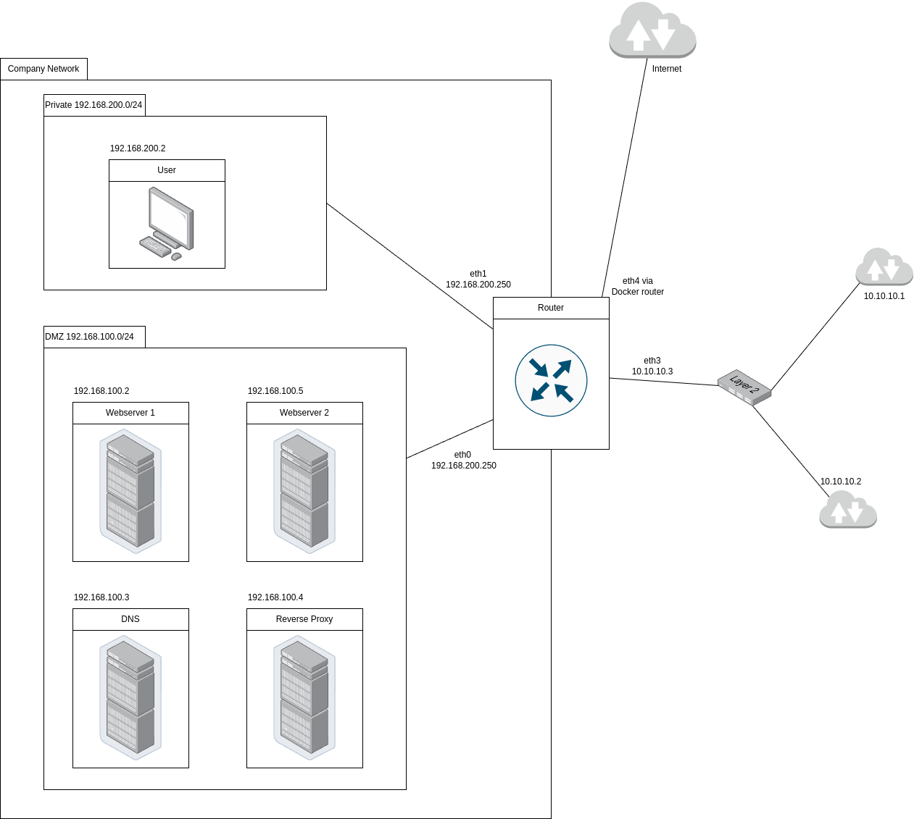

# Projet Protocoles de l'Internet : Mise en place d'un réseau "d'entreprise"

## Introduction

Ce projet est réalisé pour le cours de Protocoles de l'Internet du Semestre 5 à l'ENSEEIHT pour les élèves en FISA.

Extrait du sujet :
>L’objectif de ce projet est la bonne compréhension des principaux protocoles et mécanismes que l’on rencontre dans le réseau Internet classique de faible échelle : réseau domestique, réseau d’entreprise, etc. Un aspect n’est pas du tout traité par ce projet : la supervision du réseau, et nous éviterons d’utiliser des techniques de niveau technologique (Ethernet en particulier) pour répondre au cahier des charges. Le but est alors de monter un réseau dit d’entreprise en utilisant une démarche incrémentale pour illustrer le cours et le compléter par une partie pratique et des aspects manquants.

## Choix techniques

### Solution de virtualisation

J'ai choisi de réaliser ce projet avec [Docker](https://www.docker.com/) comme solution de virtualisation en raison de ses performances et parce que j'étais déjà familier avec cet outil.

### Configurations communes aux différents conteneurs

Je suis partit d'une image de base Ubuntu pour tout les conteneurs. J'y ai installé `iproute2` pour pouvoir parametrer la passerelle par default des conteneurs. J'ai installé `isc-dhcp-client` sur tout les conteneurs sauf le routeur pour permettre au conteneur d'obtenir son paramétrage réseau avec le DHCP.

Sur chaque conteneur, au démmarrage, je supprime la passerelle par default qui est crée par default car elle pointe vers le routeur interne de docker. Ensuite j'ajoute une nouvelle route par default vers mon routeur. Sur les conteneurs qui utilisent le DHCP, je supprime l'adresse qui est ajouté par Docker et je lance le client DHCP.

### Conteneur utilisateur

J'ai installé [w3m](https://github.com/acg/w3m), un navigateur open source conçu pour le terminal. Étant donné que j'utilise Docker, je ne peux pas utiliser d'applications graphiques comme Google Chrome ou Firefox. 

Pour empêcher le conteneur de s'arrêter immédiatement après son lancement, sa commande d'exécution consiste en une boucle infinie de `sleep`.

- **Adresse IP** : 192.168.200.2

### Conteneur DNS

J'ai utilisé [dnsmasq](https://dnsmasq.org/doc.html), un serveur dns open source simple à configurer et performant.

#### Parametrage du serveur DNS

Serveurs de DNS des deux autres réseaux :
- 10.10.10.1
- 10.10.10.2

Serveurs de DNS externes :
- 8.8.8.8
- 1.1.1.1

J'ai ajouté l'adresse de mon serveur web : `web.emilien` qui pointe vers l'adresse publique de mon réseau `10.10.10.3`. J'ai aussi ajouté une entrée qui dit que le serveur web n'a pas d'adresse IPV6.

- **Adresse IP** : 192.168.100.3

### Conteneurs serveur web

J'ai crée conteneurs serveurs webs avec la meme configuration pour pouvoir faire du load balancing (voir [Conteneur reverse proxy](#conteneur-reverse-proxy)) Pour les différencier, j'ai écris le numero du serveur sur sa page.

J'ai choisi d'utiliser [Caddy](https://caddyserver.com/), un serveur http open source écrit en Go qui peut servir des fichiers statiques. Ce choix s'explique par sa légèreté et ses performances, ainsi que par sa simplicité de configuration par rapport à un serveur web plus complexe comme Apache ou NGINX.
>It's not uncommon for Caddyfiles to be just ~15-25% the size of a less-capable nginx config. (https://caddyserver.com/)

Un serveur web plus puissant comme Apache aurait été inutile ici, car nous ne devons que servir des fichiers statiques.

- **Adresse IP serveur web 1** : 192.168.100.2
- **Adresse IP serveur web 2** : 192.168.100.5

### Conteneur routeur

- **Adresses IP** :
  - 192.168.100.250 (Réseau privé)
  - 192.168.200.250 (Réseau DMZ)
  - 10.10.10.3 (Réseau public)
  - 192.168.50.250 (Réseau pour la connexion a Internet)

### Conteneur reverse proxy

J'ai choisi d'utiliser [Caddy](https://caddyserver.com/) en tant que reverse proxy pour les memes raisons que pour le [conteneur serveur web](#conteneurs-serveur-web). J'ai donc fait pointer l'adresse de mon site (`web.emilien`) vers mes deux serveurs web avec du load balancing (répartition de charge), j'ai utilisé la stratégie `round-robin` de Caddy. Elle alterne entre les serveurs webs de manière séquentielle, par exemple la première requette ira au serveur 1 puis la deuxième au serveur 2 et la troisième ira au serveur 1. Cette stratégie permet ici de montrer facilement que le load ballancing fonctionne correctement