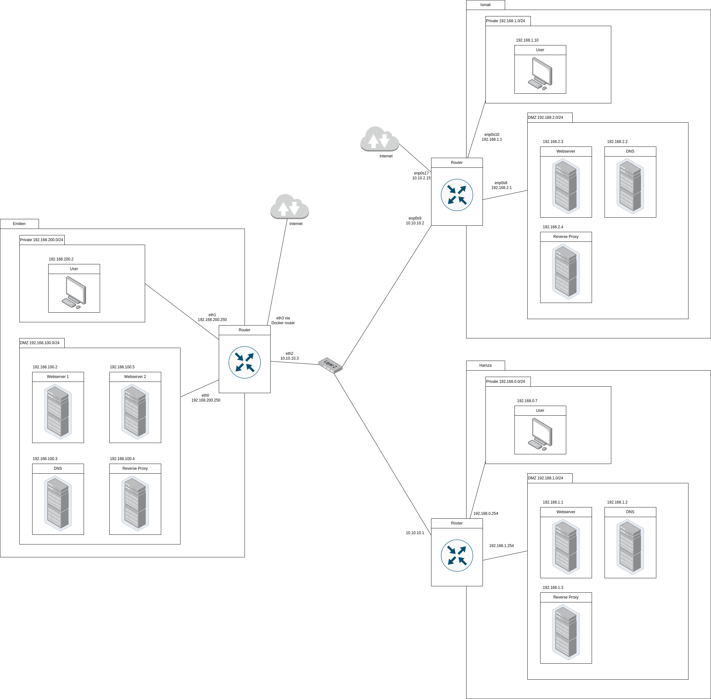

# Projet Protocoles de l'Internet : Mise en place d'un réseau "d'entreprise"

## Introduction

Ce projet est réalisé pour le cours de Protocoles de l'Internet du Semestre 5 à l'ENSEEIHT pour les élèves en FISA.

Extrait du sujet :
>L’objectif de ce projet est la bonne compréhension des principaux protocoles et mécanismes que l’on rencontre dans le réseau Internet classique de faible échelle : réseau domestique, réseau d’entreprise, etc. Un aspect n’est pas du tout traité par ce projet : la supervision du réseau, et nous éviterons d’utiliser des techniques de niveau technologique (Ethernet en particulier) pour répondre au cahier des charges. Le but est alors de monter un réseau dit d’entreprise en utilisant une démarche incrémentale pour illustrer le cours et le compléter par une partie pratique et des aspects manquants.

## Partie commune

### Carte du réseau d'interconnexion

## Documents individuels

- [Ismail](ismail.md)
- [Hamza](hamza.md)
- [Émilien](emilien.md)