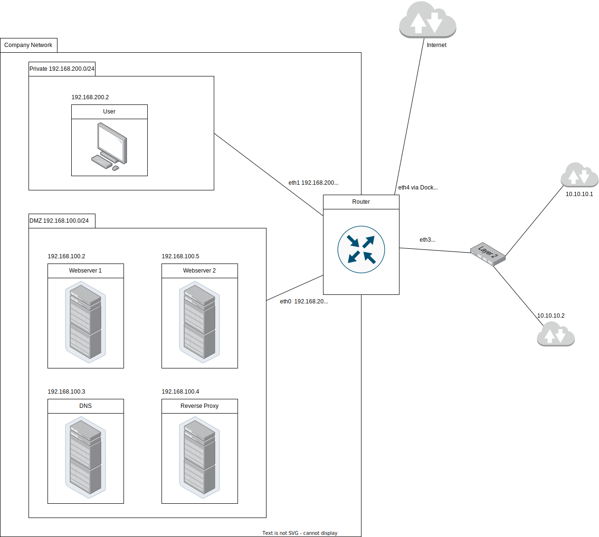

# Projet Protocoles de l'Internet : Mise en place d'un réseau "d'entreprise"

## Introduction

Ce projet est réalisé pour le cours de Protocoles de l'Internet du Semestre 5 à l'ENSEEIHT pour les élèves en FISA.

Extrait du sujet :
>L’objectif de ce projet est la bonne compréhension des principaux protocoles et mécanismes que l’on rencontre dans le réseau Internet classique de faible échelle : réseau domestique, réseau d’entreprise, etc. Un aspect n’est pas du tout traité par ce projet : la supervision du réseau, et nous éviterons d’utiliser des techniques de niveau technologique (Ethernet en particulier) pour répondre au cahier des charges. Le but est alors de monter un réseau dit d’entreprise en utilisant une démarche incrémentale pour illustrer le cours et le compléter par une partie pratique et des aspects manquants.

## Choix techniques

### Solution de virtualisation

J'ai choisi de réaliser ce projet avec [Docker](https://www.docker.com/) comme solution de virtualisation en raison de ses performances et parce que j'étais déjà familier avec cet outil.

### Conteneur utilisateur

Pour le conteneur utilisateur, je suis parti d'une image de base Ubuntu. J'y ai installé [w3m](https://github.com/acg/w3m), un navigateur open source conçu pour le terminal. Étant donné que j'utilise Docker, je ne peux pas utiliser d'applications graphiques comme Google Chrome ou Firefox. 

J'ai également installé `iproute2` pour configurer la route par défaut, qui passe par le conteneur routeur, car Docker ne permet pas de définir une passerelle pointant vers l'adresse d'un autre conteneur automatiquement. Enfin, pour vérifier que les conteneurs communiquent correctement entre eux, j'ai installé `ping` et `curl`. 

Pour empêcher le conteneur de s'arrêter immédiatement après son lancement, sa commande d'exécution consiste en une boucle infinie de `sleep`.

- **Adresse IP** : 192.168.200.2

### Conteneur DNS

Cette section est en cours de développement.

- **Adresse IP** : 192.168.100.3

### Conteneur serveur web

Pour le conteneur serveur web, je suis également parti d'une image Ubuntu. J'ai choisi d'utiliser [Caddy](https://caddyserver.com/), un serveur http open source écrit en Go qui peut servir des fichiers statiques. Ce choix s'explique par sa légèreté et ses performances, ainsi que par sa simplicité de configuration par rapport à un serveur web plus complexe comme Apache ou NGINX.
>It's not uncommon for Caddyfiles to be just ~15-25% the size of a less-capable nginx config. (https://caddyserver.com/)

Un serveur web plus puissant comme Apache aurait été inutile ici, car nous ne devons que servir des fichiers statiques.

J'ai également installé `iproute2` pour configurer la route par défaut passant par le conteneur routeur, et ajouté `ping` et `curl` pour tester la communication entre les conteneurs.

- **Adresse IP** : 192.168.100.2

### Conteneur routeur

Pour le conteneur routeur, je suis parti d'une image Ubuntu. J'ai installé `iptables` pour configurer le routage. J'ai également ajouté `ping` pour tester les connexions réseau.

- **Adresses IP** :
  - 192.168.100.250
  - 192.168.200.250
  - 10.10.10.3
