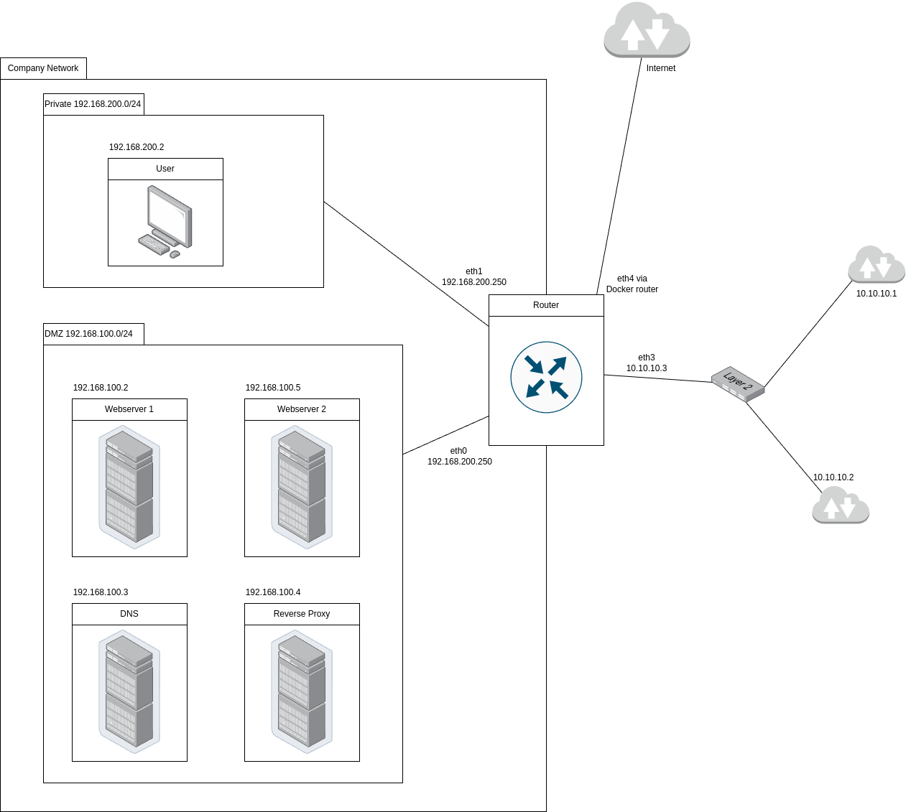

## Choix techniques

### Solution de virtualisation

J'ai choisi de réaliser ce projet avec [Docker](https://www.docker.com/) comme solution de virtualisation en raison de ses performances et parce que j'étais déjà familier avec cet outil.

### Configurations communes aux différents conteneurs

Je suis parti d'une image de base Alpine pour tous les conteneurs. J'ai fait ce choix pour la légèreté d'Alpine Linux (voir [Poids de la simulation](#poid-de-la-simulation)). J'y ai installé `iproute2` pour pouvoir paramétrer la passerelle par défaut des conteneurs. J'ai utilisé le client DHCP [udhcpc](https://wiki.alpinelinux.org/wiki/Udhcpc) sur tous les conteneurs sauf le routeur, pour permettre au conteneur d'obtenir son paramétrage réseau avec le DHCP. J'ai dû modifier le script utilisé par udhcpc pour appliquer les paramètres DNS récupérés avec le DHCP. Le script de base utilise `mv` sur `/etc/resolve.conf`, mais ce fichier est déjà en cours d'utilisation, donc on ne peut pas le modifier avec mv. J'ai donc modifié le script pour qu'il écrive dans `/etc/resolve.conf` avec des `>` et des `>>`.

Sur chaque conteneur, au démarrage, je supprime la passerelle par défaut qui est créée par défaut car elle pointe vers le routeur interne de Docker. Ensuite, j'ajoute une nouvelle route par défaut vers mon routeur. Sur les conteneurs qui utilisent le DHCP, je supprime l'adresse qui est ajoutée par Docker et je lance le client DHCP.

### Conteneur utilisateur

J'ai installé [w3m](https://github.com/acg/w3m), un navigateur open source conçu pour le terminal. Étant donné que j'utilise Docker, je ne peux pas utiliser d'applications graphiques comme Google Chrome ou Firefox. 

Pour empêcher le conteneur de s'arrêter immédiatement après son lancement, sa commande d'exécution consiste en une boucle infinie de `sleep`.

- **Adresse IP** : 192.168.200.2

### Conteneur DNS

J'ai utilisé [dnsmasq](https://dnsmasq.org/doc.html), un serveur DNS open source simple à configurer et performant.

#### Paramétrage du serveur DNS

Serveurs DNS des deux autres réseaux :
- 10.10.10.1
- 10.10.10.2

Serveurs DNS externes :
- 8.8.8.8
- 1.1.1.1

J'ai ajouté l'adresse de mon serveur web : `web.emilien.fr`, qui pointe vers l'adresse publique de mon réseau `10.10.10.3`. J'ai aussi ajouté une entrée qui indique que le serveur web n'a pas d'adresse IPv6.

- **Adresse IP** : 192.168.100.3

### Conteneurs serveur web

J'ai créé deux conteneurs serveurs web avec la même configuration pour pouvoir faire du load balancing (voir [Conteneur reverse proxy](#conteneur-reverse-proxy)). Pour les différencier, j'ai écrit le numéro du serveur sur sa page.

J'ai choisi d'utiliser [Caddy](https://caddyserver.com/), un serveur HTTP open source écrit en Go qui peut servir des fichiers statiques. Ce choix s'explique par sa légèreté, ses performances, ainsi que par sa simplicité de configuration par rapport à un serveur web plus complexe comme Apache ou NGINX.
> It's not uncommon for Caddyfiles to be just ~15-25% the size of a less-capable nginx config. (https://caddyserver.com/)

Un serveur web plus puissant comme Apache aurait été inutile ici, car nous ne devons que servir des fichiers statiques.

- **Adresse IP serveur web 1** : 192.168.100.2
- **Adresse IP serveur web 2** : 192.168.100.5

### Conteneur routeur

J'ai utilisé les `iptables` pour configurer le pare-feu de mon routeur. 

J'ai utilisé [kea](https://www.isc.org/kea/) comme serveur DHCP pour sa légèreté et sa simplicité de configuration avec un fichier JSON. J'ai mis une pool de DHCP pour le réseau privé et une autre pour la DMZ. J'ai attribué des baux statiques pour tous les serveurs de la DMZ.

Le routeur est configuré pour que la DMZ et le réseau privé puissent communiquer ensemble et pour qu'ils puissent accéder à Internet, notamment pour pouvoir installer des paquets pendant que le conteneur tourne. J'ai ouvert les ports 80 et 443 qui sont redirigés vers mon reverse proxy. J'ai également ouvert le port 53 en TCP et en UDP, redirigé vers le serveur DNS.

- **Adresses IP** :
  - 192.168.100.250 (Réseau privé)
  - 192.168.200.250 (Réseau DMZ)
  - 10.10.10.3 (Réseau public)
  - 192.168.50.250 (Réseau pour la connexion à Internet)

### Conteneur reverse proxy

J'ai choisi d'utiliser [Caddy](https://caddyserver.com/) en tant que reverse proxy pour les mêmes raisons que pour le [conteneur serveur web](#conteneurs-serveur-web). J'ai donc fait pointer l'adresse de mon site (`web.emilien`) vers mes deux serveurs web avec du load balancing (répartition de charge). J'ai utilisé la stratégie `round-robin` de Caddy. Elle alterne entre les serveurs web de manière séquentielle, par exemple la première requête ira au serveur 1, puis la deuxième au serveur 2, et la troisième ira au serveur 1. Cette stratégie permet ici de montrer facilement que le load balancing fonctionne correctement.

- **Adresse IP** : 192.168.100.2

### Edgeshark

J'ai ajouté le docker-compose de [Edgeshark](https://edgeshark.siemens.io/), qui est un conteneur open source créé par Siemens et qui permet, avec Wireshark de l'hôte, de capturer les paquets des réseaux Docker. J'ai utilisé ce docker-compose comme un override qui me permet de le garder séparé de mon docker-compose principal. Edgeshark permet de créer une interface virtuelle pour chaque connexion à un réseau Docker et pour chaque réseau Docker. Il rend accessible, sur le port 5001 de l'hôte, un site web qui permet de visualiser à quel réseau correspond chaque interface, ainsi que de visualiser le réseau Docker.

## Poids de la simulation

Les images de la simulation pèsent en tout environ 500 Mo de stockage. Une fois les conteneurs lancés, la simulation ne consomme que 75 Mo de RAM. Alpine Linux m'a permis d'optimiser ces métriques. Lorsque j'utilisais des images Ubuntu, les images faisaient plusieurs gigaoctets et plus de 300 Mo de RAM.

## Problèmes rencontrés

### Problème de communication avec le réseau physique

Lorsque j'ai activé le mode macvlan sur le réseau public de mon routeur, Docker me donnait une erreur qui disait que l'interface parente devait avoir le format `eth0.10`. Cependant, l'interface Ethernet de mon ordinateur s'appelle `enp0s3`. J'ai donc essayé de la renommer en `eth0`, mais cela n'a pas fonctionné. Après des recherches, j'ai découvert qu'en exécutant les commandes Docker avec `sudo`, cela fonctionnait alors que mon utilisateur était dans le groupe Docker. J'ai donc continué à utiliser `sudo` pour lancer les commandes Docker. Après des recherches supplémentaires, j'ai découvert que le problème venait de Docker Desktop. En effet, Docker Desktop exécute Docker dans une machine virtuelle, qui ne supporte pas le macvlan. Cela fonctionnait avec `sudo`, car Docker Desktop ne s'exécute qu'en mode utilisateur. Lorsque l'on exécute Docker avec `sudo`, il s'exécute sur Docker Engine, qui lui est installé sur la machine hôte et supporte le macvlan. Pour résoudre le problème sans devoir utiliser `sudo`, je dois changer de contexte Docker pour passer de `docker-desktop` à `default` avec la commande `docker context use default`.

### Passage d'images Ubuntu à Alpine

J'ai commencé le projet avec des conteneurs basés sur des images Ubuntu, car cela était plus simple, mais dans l'optique d'avoir une simulation la plus légère possible, j'ai décidé de passer sur des images Alpine qui sont beaucoup plus légères.

Plusieurs problèmes se sont alors présentés, notamment le fait que certains paquets que j'utilisais sur Ubuntu n'existaient pas sur Alpine. Par exemple, `dhclient`, le client DHCP que j'utilisais sur les conteneurs utilisateurs, n'est pas disponible dans les dernières versions d'Alpine. J'ai donc utilisé `udhcpc`, qui est installé par défaut sur Alpine. J'ai rencontré un problème avec `udhcpc` : une fois qu'il a récupéré les informations du DHCP, il essaie de les écrire dans `/etc/resolve.conf` avec un `mv`. Cependant, ce fichier est en cours d'utilisation, donc on ne peut pas le modifier avec `mv`. J'ai donc modifié le script pour qu'il écrive dans `/etc/resolve.conf` avec des `>` et des `>>`.

De même, le serveur DHCP `dhcpd` n'est pas disponible sur Alpine. Je l'ai donc remplacé par `kea`, un autre serveur DHCP open source également développé par ISC.

En revanche, `caddy`, le serveur web que j'utilise, est disponible sur Alpine en tant que package, ce qui m'évite de l'installer manuellement.
