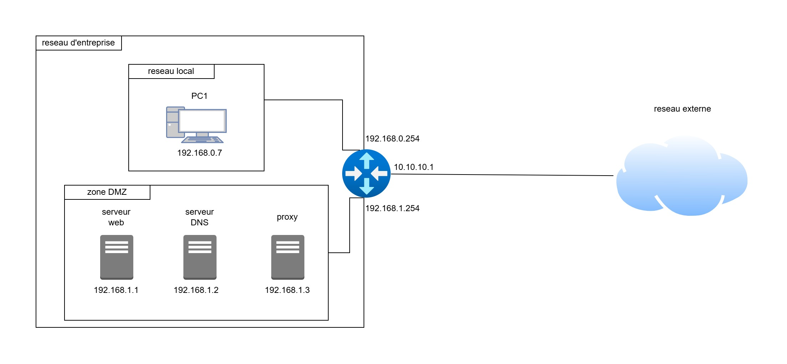
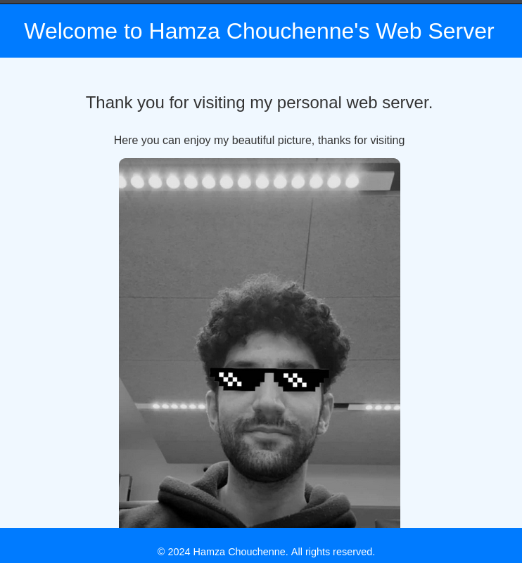

# Architecture réseau de l'entreprise


# Choix de la virtualisation
Pour la solution de virtualisation, j'ai choisi **VirtualBox** car il est facile à utiliser. De plus, ce n'est pas la première fois que je l'utilise. Concernant les machines virtuelles (VM), j'ai opté pour des **VM Kali Linux et Debian**, car elles sont légères et incluent déjà des outils nécessaires comme **Wireshark** pour ce projet.

# Configuration globale
Nous avons défini deux zones principales dans notre réseau privé :
- **Réseau local** : 192.168.0.0/24
- **Réseau DMZ** : 192.168.1.0/24
- **Réseau extérieur** : 10.10.10.0/24

Après avoir défini ces réseaux, nous avons affecté une adresse IP et une passerelle par défaut à chaque équipement, puis vérifié la connectivité entre les différents équipements.

# Configuration DHCP
Pour faciliter l'attribution des adresses IP, nous avons opté pour une solution **DHCP**. Nous avons créé une plage de **10 adresses** pour chaque réseau privé. De plus, nous avons fixé les adresses IP de nos serveurs pour garantir leur accessibilité :
- **Serveur Web** : 192.168.1.1
- **Autre serveur** : 192.168.1.2

Nous avons également défini le **serveur DNS** afin que les clients DHCP sachent à quel serveur s'adresser pour la résolution de noms.

# Configuration des serveurs

## Serveur Web
J'ai choisi le serveur **Apache2** pour héberger le site web. Une petite page d'accueil a été créée pour informer les clients que c'est bien mon serveur.



## Serveur DNS
Tout d'abord, j'ai essayé avec **BIND9**, mais il était difficile à configurer et j'ai rencontré plusieurs problèmes. J'ai donc opté pour une solution plus simple : **dnsmasq**.

Pour la hiérarchie DNS, nous avons configuré des **forwarders**. Si notre serveur ne trouve pas la correspondance entre une adresse IP et un nom de domaine, il envoie la requête vers un autre serveur. J'ai choisi le nom de domaine **web.hamza.n7**.

Voici la configuration de **dnsmasq** :

```bash
# Spécifie que le serveur DNS doit écouter sur l'interface réseau eth0
interface = eth0

# Cette option indique que seules les requêtes DNS contenant un nom de domaine doivent être envoyées à des serveurs DNS en amont
domain-needed

# Cette option empêche le serveur DNS d'accepter des réponses avec des adresses IP privées (par exemple, 10.x.x.x, 192.168.x.x) dans les requêtes DNS.
bogus-priv

# Cette option empêche la lecture du fichier /etc/resolv.conf pour les serveurs DNS en amont. Les serveurs DNS sont spécifiés manuellement ici.
no-resolv

# Définit les serveurs DNS en amont à utiliser lorsque le serveur local ne peut pas répondre à la requête.
server = 10.10.10.3
server = 10.10.10.2

# Cette ligne indique que la requête pour le domaine "web.hamza.n7" doit renvoyer l'adresse IP 10.10.10.1 (en IPv4).
address = /web.hamza.n7/10.10.10.1

# Cette ligne indique que la requête pour le domaine "web.hamza.n7" doit renvoyer une adresse IPv6 non spécifiée (::).
address = /web.hamza.n7/::
```

# Accès au serveur depuis l'extérieur
Tout d'abord, il est nécessaire de s'assurer que tous les équipements peuvent communiquer avec l'extérieur. Pour cela, il faut configurer la **traduction d'adresse (NAT)** en utilisant la commande `iptables`. Cela permettra de traduire les adresses privées en adresses publiques.

Ensuite, pour que nos serveurs soient accessibles depuis l'extérieur, nous avons configuré un **DNAT** (Destination NAT) et effectué des redirections de ports :
- **Port 80** : redirigé vers notre serveur web
- **Port 53** : redirigé vers notre serveur DNS

Cependant, cette approche présente des limitations pratiques, notamment en termes de sécurité et de gestion. Pour cela, nous avons opté pour une solution plus sécurisée et plus flexible : le **reverse proxy**. Cette solution est :
- **Plus sécurisée** : elle permet de mieux contrôler le trafic entrant et sortant.
- **Extensible** : facile à ajouter ou supprimer des serveurs sans interrompre le service.
  
En résumé, le reverse proxy offre une meilleure gestion du trafic et une plus grande sécurité pour nos serveurs.

# Politique de firewall
Concernant les **politiques de firewall**, nous avons mis en place les règles suivantes :
- Acceptation du trafic entrant sur le port **80** pour le serveur web.
- Acceptation du trafic entrant sur le port **53** pour le serveur DNS.

Ces règles assurent que seul le trafic légitime passe par ces ports, garantissant ainsi la sécurité de notre infrastructure.


