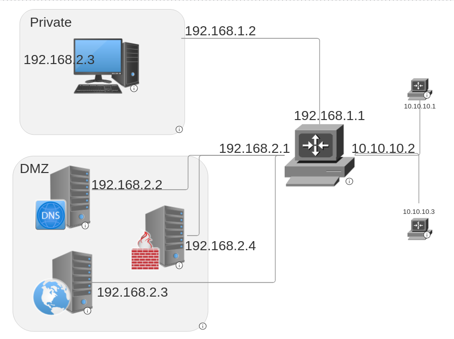

## **Choix Techniques**



### **Solution de Virtualisation**

Pour ce projet, j'ai utilisé **VirtualBox** comme solution de virtualisation pour déployer et gérer les VMs. Chaque VM correspond à un service spécifique dans le réseau de l'entreprise.

---

### **Configurations Communes aux VMs**

- **Image de Base :** Toutes les VMs sont construites sur une distribution Linux légère, Debian.
- **Réseau :** Chaque VM est configurée avec des adresses IP statiques lorsque c'est applicable. Les adresses IP dynamiques sont gérées par le serveur DHCP pour certaines VMs.
- **Passerelle par Défaut :** Pour chaque VM, la passerelle par défaut pointe vers la **VM Routeur** pour router le trafic entre le réseau privé interne, la DMZ et l'internet public.
- **Configuration DNS :** Toutes les VMs utilisent le serveur DNS interne (192.168.2.2) pour résoudre les noms de domaine de l'entreprise, tels que `www.alrismail.om`.

---

### **VMs et Leurs Configurations**

#### **1. VM Client**
- **But :** Agit comme la machine cliente pour accéder aux services.
- **Adresse IP :** `192.168.1.10`
- **Notes :** 
    - Configurée pour utiliser DHCP pour l'attribution dynamique d'IP si nécessaire.
    - Utilise le serveur DNS à `192.168.2.2`.

---

#### **2. VM Serveur DNS**
- **But :** Fournit la résolution DNS pour les domaines de l'entreprise.
- **Logiciel :** `dnsmasq`
- **Points Forts de la Configuration :**
    - Domaine personnalisé : `alrismail.om`.
    - Enregistrement A : `www.alrismail.om -> 192.168.2.4` (Reverse Proxy)
- **Adresse IP :** `192.168.2.2` ( Configuré par netwok-manager )

---

#### **3. VM Routeur**
- **But :** Route le trafic entre le réseau privé, la DMZ et l'internet public.
- **Interfaces Réseau :**
    - `192.168.1.1` (Réseau Privé)
    - `192.168.2.1` (DMZ)
    - `10.0.0.2` (Réseau Externe)
    - `10.0.2.15` (Interface NAT)
- **Points Forts de la Configuration :**
    - NAT configuré pour l'accès à internet externe.
    - Routes statiques configurées pour interconnecter les réseaux privé et DMZ.
- **Adresse IP :** Multi-homed, comme ci-dessus.

---

#### **4. VM Serveur Web**
- **But :** Servir des fichiers statiques pour le site web.
- **Logiciel :** Apache2
- **Points Forts de la Configuration :**
    - Pages statiques pour `www.alrismail.om`.
    - Pages différenciées pour identifier chaque serveur.
    - Équilibré par le proxy inverse.
- **Adresses IP :**
    - Serveur Web : `192.168.2.3` ( Configuré par nmcli )

---

#### **5. VM Proxy Inverse**
- **But :** Agit comme un proxy inverse et un équilibrage de charge pour les serveurs web.
- **Logiciel :** Nginx
- **Points Forts de la Configuration :**
    - Configuration du Proxy Inverse :
        ```nginx
        server {
                listen 80;
                server_name www.alrismail.om;
                location / {
                        proxy_pass http://192.168.2.3; # Transférer aux serveurs web
                }
        }
        ```
    - Gère les requêtes pour `www.alrismail.om` et les transfère aux serveurs web en mode round-robin.
- **Adresse IP :** `192.168.2.4` ( Configuré par nmcli )

---

### **Configuration Réseau**

- **Configuration Réseau :**
    - La VM Routeur connecte tous les sous-réseaux en utilisant le **Réseau Interne** de VirtualBox pour `192.168.1.x` (réseau privé) et `192.168.2.x` (DMZ).
    - Un adaptateur NAT ou Ponté séparé connecte la VM Routeur au réseau externe pour l'accès à internet.

- **Intégration DHCP :**
    - Le serveur DHCP (fonctionnant sur la VM Routeur) attribue dynamiquement des adresses IP à la VM Utilisateur, facilitant l'administration.

---
